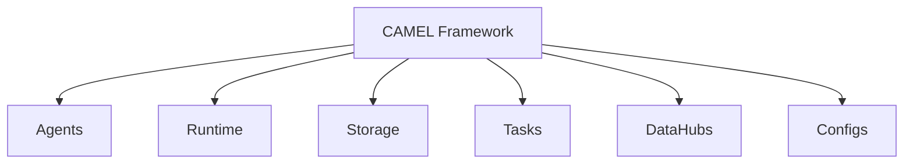
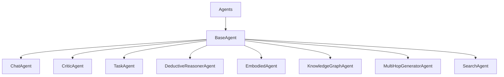
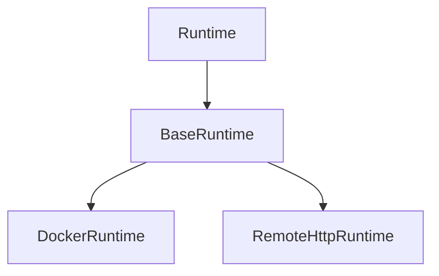
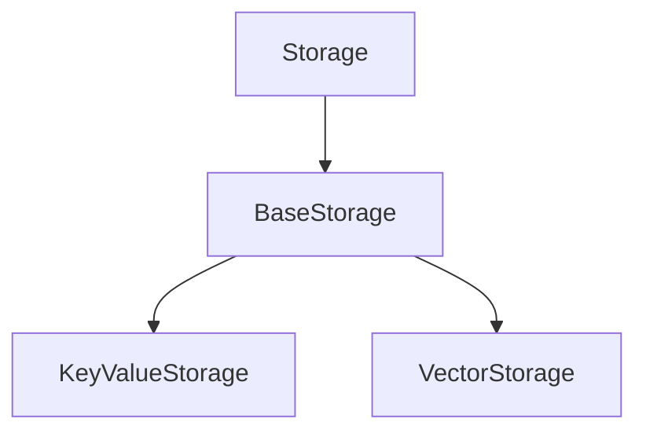
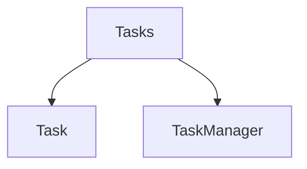
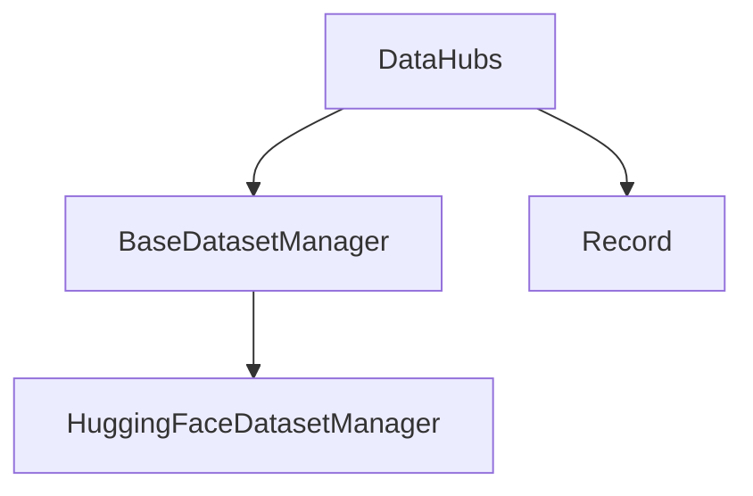
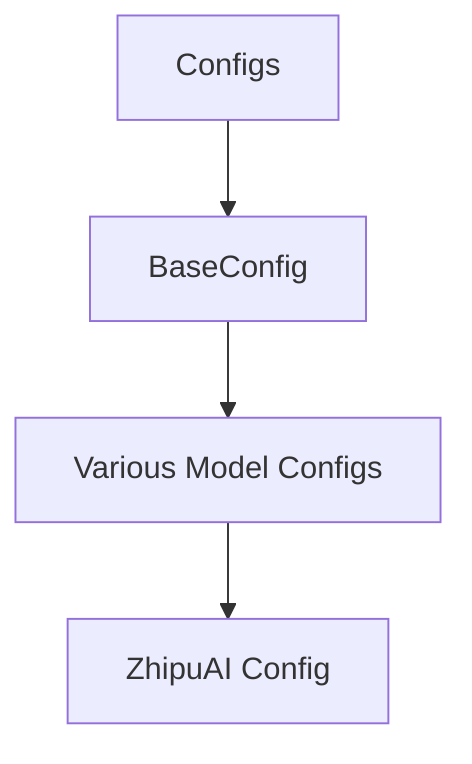
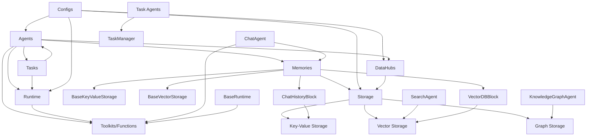

# CAMEL Software Architecture

## Architecture Diagram

### CAMEL Framework

```mermaid
graph TD
    CAMEL[CAMEL Framework] --> Agents
    CAMEL --> Runtime
    CAMEL --> Storage
    CAMEL --> Tasks
    CAMEL --> DataHubs
    CAMEL --> Configs

    %% Agents Section
    Agents --> BaseAgent[BaseAgent]
    BaseAgent --> ChatAgent[ChatAgent]
    BaseAgent --> CriticAgent[CriticAgent]
    BaseAgent --> TaskAgent[TaskAgent]
    BaseAgent --> DeductiveReasonerAgent[DeductiveReasonerAgent]
    BaseAgent --> EmbodiedAgent[EmbodiedAgent]
    BaseAgent --> KnowledgeGraphAgent[KnowledgeGraphAgent]
    BaseAgent --> MultiHopGeneratorAgent[MultiHopGeneratorAgent]
    BaseAgent --> SearchAgent[SearchAgent]

    %% Runtime Section
    Runtime --> BaseRuntime[BaseRuntime]
    BaseRuntime --> DockerRuntime[DockerRuntime]
    BaseRuntime --> RemoteHttpRuntime[RemoteHttpRuntime]
    BaseRuntime --> LLMGuardRuntime[LLMGuardRuntime]
    Runtime --> TaskConfig[TaskConfig]

    %% Storage Section
    Storage --> KeyValueStorage[Key-Value Storage]
    Storage --> VectorStorage[Vector Storage]
    Storage --> GraphStorage[Graph Storage]
    
    KeyValueStorage --> BaseKeyValueStorage[BaseKeyValueStorage]
    BaseKeyValueStorage --> InMemoryKeyValueStorage[InMemoryKeyValueStorage]
    BaseKeyValueStorage --> JsonStorage[JsonStorage]
    BaseKeyValueStorage --> RedisStorage[RedisStorage]
    
    VectorStorage --> BaseVectorStorage[BaseVectorStorage]
    BaseVectorStorage --> QdrantStorage[QdrantStorage]
    BaseVectorStorage --> MilvusStorage[MilvusStorage]
    
    GraphStorage --> BaseGraphStorage[BaseGraphStorage]
    BaseGraphStorage --> Neo4jGraph[Neo4jGraph]
    BaseGraphStorage --> NebulaGraph[NebulaGraph]

    %% Tasks Section
    Tasks --> Task[Task]
    Tasks --> TaskManager[TaskManager]

    %% DataHubs Section
    DataHubs --> BaseDatasetManager[BaseDatasetManager]
    BaseDatasetManager --> HuggingFaceDatasetManager[HuggingFaceDatasetManager]
    DataHubs --> Record[Record]

    %% Configs Section
    Configs --> BaseConfig[BaseConfig]
    BaseConfig --> ModelConfig[Various Model Configs]
    ModelConfig --> ZhipuAIConfig[ZhipuAI Config]
    ModelConfig --> VLLMConfig[VLLM Config]
    ModelConfig --> TogetherAIConfig[TogetherAI Config]
```

### CAMEL Top Level Architecture

### CAMEL Agents

### CAMEL Runtime

### CAMEL Storage

### CAMEL Tasks

### CAMEL DataHubs

### CAMEL Configs

## Component Interaction Diagram

一个展示CAMEL项目中各组件之间调用关系的图表。这个图表将展示哪些组件依赖于其他组件，以及它们如何交互。

## Component Interaction Description

- 代理(Agents)系统是核心，它调用其他多个组件：
  - 调用运行时(Runtime)执行任务
  - 使用记忆(Memories)存储对话历史和知识
  - 操作任务(Tasks)系统来管理复杂工作
  - 使用工具(Toolkits)执行具体功能
- 记忆(Memories)系统依赖于存储(Storage)组件：
  - 对话历史通常使用键值存储(KeyValueStorage)
  - 向量数据库块使用向量存储(VectorStorage)
- 存储(Storage)系统提供多种存储后端：
  - 键值存储用于简单数据
  - 向量存储用于嵌入和语义搜索
  - 图存储用于知识图谱
- 配置(Configs)系统影响所有组件的行为和参数
- 特定代理类型有特定依赖关系：
  - 聊天代理(ChatAgent)依赖工具和记忆
  - 知识图谱代理(KnowledgeGraphAgent)依赖图存储
  - 搜索代理(SearchAgent)依赖向量存储

这个调用关系图展示了CAMEL是如何构建为一个模块化、可扩展的框架，其中各组件可以相互协作，同时保持清晰的职责分离。

### Core Calling Patterns

1. **Agents → Runtime**: Agents use Runtime to execute tasks and tools
   - Chat agents call functions through Runtime
   - Task agents schedule execution through Runtime

2. **Agents → Memories → Storage**:
   - Agents maintain conversation history and knowledge through Memories
   - Memories use different Storage backends for persistence

3. **Agents → Tasks**:
   - Complex agents delegate subtasks to Task system
   - TaskAgent specifically manages Tasks

4. **Tasks → Runtime**:
   - Tasks are executed in appropriate Runtime environments

5. **Configs → All Components**:
   - Configuration objects configure behavior of all major components

### Key Dependencies

- **ChatAgent** depends on:
  - Toolkits (for function calling)
  - Memories (for conversation history)
  - Runtime (for execution)

- **KnowledgeGraphAgent** depends on:
  - GraphStorage (for knowledge persistence)

- **SearchAgent** depends on:
  - VectorStorage (for semantic search)

- **Memory System** depends on:
  - BaseKeyValueStorage (for conversation history)
  - BaseVectorStorage (for embeddings and semantic retrieval)

- **Runtime** depends on:
  - Toolkits (for function definitions)
  - Configs (for execution parameters)

## Component Descriptions

### Agents

The core components that represent autonomous entities capable of performing specific tasks:

- **BaseAgent**: Abstract base class for all agents
- **ChatAgent**: Primary implementation for handling conversations with LLMs
- **CriticAgent**: Evaluates and critiques responses
- **TaskAgent**: Handles task decomposition and management
- **Other specialized agents**: DeductiveReasonerAgent, EmbodiedAgent, KnowledgeGraphAgent, etc.

### Runtime

Components that handle execution environments:

- **BaseRuntime**: Abstract base class for runtime environments
- **DockerRuntime**: Handles execution in Docker containers
- **RemoteHttpRuntime**: Manages HTTP-based remote execution
- **LLMGuardRuntime**: Provides security/filtering for LLM interactions
- **TaskConfig**: Configuration for task execution

### Storage

Systems for data persistence and retrieval:

- **Key-Value Storage**: Simple key-value storage implementations
- **Vector Storage**: Vector database integrations for embedding storage
- **Graph Storage**: Graph database connections for knowledge graphs

### Tasks

Task management components:

- **Task**: Represents a single task to be performed
- **TaskManager**: Manages and organizes multiple tasks

### DataHubs

Data management components:

- **BaseDatasetManager**: Abstract base class for dataset management
- **HuggingFaceDatasetManager**: Integration with HuggingFace datasets
- **Record**: Data structure for individual records

### Configs

Configuration components:

- **BaseConfig**: Foundation for all configuration objects
- **Model-specific configs**: Configurations for different LLM providers
